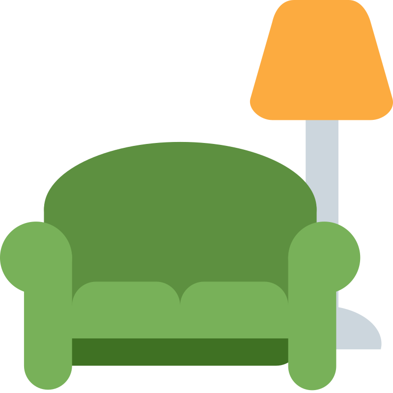
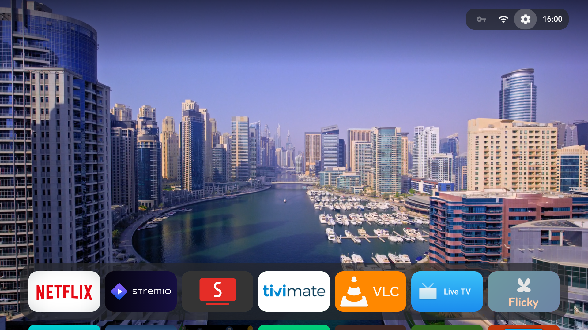
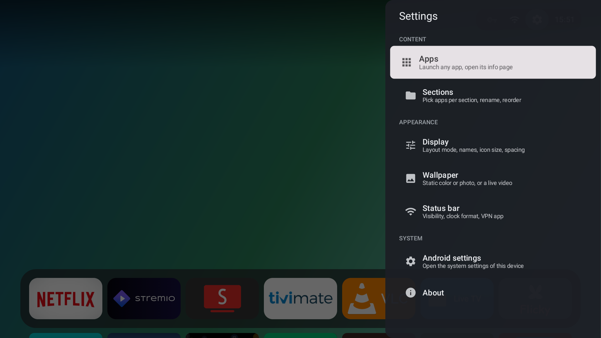
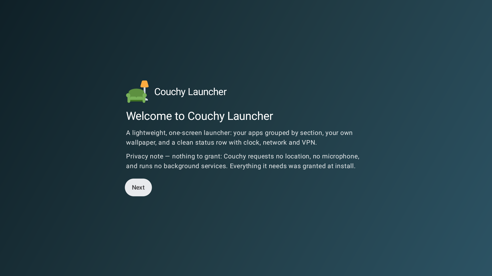

<a id="english"></a>

<div align="center">



# Couchy Launcher

**A fast, private, one-screen home launcher for Android TV & Google TV.**


[**English**](#english) · [中文](#chinese) — [Contributing](CONTRIBUTING.md) · [Licensing](LICENSING.md)

https://github.com/user-attachments/assets/6f21913e-1948-4543-9983-64dc68c602fa


<a href="https://www.buymeacoffee.com/conreo" target="_blank">
    
</a>


</div>

One screen, remote-driven, for 1080p and 4K TVs. No network requests out of the box — the wallpaper is a local gradient and settings live in a single file on the device.

| Live aerial wallpaper | Settings | First-run wizard |
|:---:|:---:|:---:|
|  |  |  |

---

## Features

- **Three layouts** — Carousel, Grid, or a floating glass Dock (press **Down** to expand to the full grid).
- **Sections** you rename, reorder and fill; an app can appear in several. New installs go to the first section.
- **Wallpapers** — gradients, your own photo, a looping video, or optional built-in aerial videos (Apple / Amazon / community, streamed only when enabled), with speed control and cross-fades.
- **Save & load** your full configuration — categories, layout, wallpaper, and all settings — as a JSON file.
- **18 languages** with a dedicated language picker in Launcher settings.
- **Adjustable** icon size, spacing, corner roundness, interface scale, dimming, and an optional glass status-bar panel.
- **Status row** — clock, network state, optional VPN button.
- **D-pad only** — text entry happens only inside dialogs.
- **17 languages** (+ English), auto-selected from your system language:
  العربية · Deutsch · Español · Français · हिन्दी · Bahasa Indonesia · Italiano · 日本語 · 한국어 · Nederlands · Polski · Português · Русский · ไทย · Türkçe · Tiếng Việt · 中文.

---

## ⚠️ Aerial wallpaper notice

The built-in aerial video wallpapers are **opt-in and off by default**. When enabled, they stream public video files from **Apple** and **Amazon** CDNs — these are non-free, third-party services. No credentials or private data are sent, but the network traffic goes to proprietary infrastructure. If you want a fully libre setup, use the gradient, photo, or local video wallpaper options instead.

---

## Requirements

- **Android TV or Google TV** (requires the `leanback` feature — it won't install on phones/tablets).
- **Android 5.0 (Lollipop) or newer** — the whole Android TV lineage.
- **ARM (32- or 64-bit) or x86** — one universal APK covers every box, old and new.
- **No dependencies** — no companion app and **no Google Play Services** required; runs on AOSP boxes too.
- Driven entirely by the **remote / D-pad**; no touchscreen needed.

---

## Install

**1. Enable ADB debugging on the TV**

- `Settings → System → About →` click **Android TV OS build** 7 times
- `Settings → System → Developer options →` enable **USB / Wireless debugging**

**2. Connect and install from your computer** (TV IP is under `Settings → Network`):

```sh
adb connect <tv-ip>:5555
adb install -r couchy-launcher.apk
```

Building from source instead: see [CONTRIBUTING.md](CONTRIBUTING.md).

---

## Set as default launcher

**Generic Android TV / AOSP boxes** — press **Home**, pick **Couchy Launcher**, choose **Always**.

**Certified Google TV** — Google blocks the on-screen home picker, so set it once over ADB:

```sh
adb shell cmd package set-home-activity com.conreo.couchytv/.MainActivity
```

<details>
<summary><b>Stock launcher still taking over?</b></summary>

<br>

Check which launcher grabs **Home**:

```sh
adb shell cmd package resolve-activity -a android.intent.action.MAIN -c android.intent.category.HOME
```

Disable whichever package it reports (reversible with `adb shell pm enable <package>`) — the usual suspects:

```sh
adb shell pm disable-user --user 0 com.google.android.apps.tv.launcherx      # Google TV
adb shell pm disable-user --user 0 com.google.android.tvlauncher             # Android TV
adb shell pm disable-user --user 0 com.google.android.tungsten.setupwraith   # setup/recovery
```

Re-check; if another launcher takes over, disable that one too, until **Home** lands on Couchy.

</details>

The built-in setup wizard walks through this with your TV's IP pre-filled. No computer? It also offers a button-remap method (map **Home** to Couchy with an app like Button Mapper).

---

## Privacy

No ads, analytics, accounts or background services. The only network use is optional aerial-video streaming, off by default. Sections, ordering, hidden apps and wallpaper stay in one local file.

## License

**GNU GPLv3** — free, open source, copyleft. See [LICENSING.md](LICENSING.md) for the app, artwork and bundled libraries.

## Contributing & translations

See [CONTRIBUTING.md](CONTRIBUTING.md). Adding a language is copying `values/strings.xml` to `values-<lang>/` and translating the values.

<br>

---

<a id="chinese"></a>

<div align="center">


# Couchy Launcher

**为 Android TV 与 Google TV 打造的快速、私密、单屏主页启动器。**


[English](#english) · [**中文**](#chinese) — [参与贡献](CONTRIBUTING.md) · [许可证](LICENSING.md)

https://github.com/user-attachments/assets/6f21913e-1948-4543-9983-64dc68c602fa


<a href="https://www.buymeacoffee.com/conreo" target="_blank">
    
</a>


</div>

单屏、遥控器操作，支持 1080p 与 4K 电视。开箱不联网——壁纸是本地渐变，设置存在设备上的单个文件里。

| 航拍视频壁纸 | 设置 | 首次设置向导 |
|:---:|:---:|:---:|
|  |  |  |

---

## 功能

- **三种布局**——轮播、网格，或悬浮玻璃底栏 Dock（按「下」展开为完整网格）。
- **分区**可自行重命名、排序、填充；一个应用可归入多个分区。新安装的应用进入第一个分区。
- **壁纸**——渐变、你自己的照片、循环视频，或可选的内置航拍视频（Apple / Amazon / 社区，仅在开启时才联网），带速度控制与淡入淡出。
- **可调**图标大小、间距、圆角、界面缩放、暗化，以及可选的玻璃状态栏面板。
- **保存与加载**完整配置——分类、布局、壁纸及所有设置导出为 JSON 文件。
- **18 种语言**（另加英文），在启动器设置中可选择语言。
  العربية · Deutsch · Español · Français · हिन्दी · Bahasa Indonesia · Italiano · 日本語 · 한국어 · Nederlands · Polski · Português · Русский · ไทย · Türkçe · Tiếng Việt · 中文。

---

## ⚠️ 航拍壁纸说明

内置航拍视频壁纸是**可选功能，默认关闭**。启用后，会从 **Apple** 和 **Amazon** CDN 串流公共视频文件——这些是非自由的第三方服务。不会发送任何凭据或隐私数据，但网络流量会经过专有基础设施。如需完全自由的配置，请使用渐变、照片或本地视频壁纸。

---

## 系统要求

- **Android TV 或 Google TV**（需要 `leanback` 特性——手机 / 平板无法安装）。
- **Android 5.0（Lollipop）及以上**——覆盖整个 Android TV 世代。
- **ARM（32/64 位）或 x86**——单个通用 APK 适配新旧所有盒子。
- **无依赖**——无需伴侣应用，**无需 Google Play 服务**；AOSP 盒子也能运行。
- 完全用**遥控器 / 方向键**操作，无需触摸屏。

---

## 安装

**1. 在电视上开启 ADB 调试**

- `设置 → 系统 → 关于 →` 连续点击 **Android TV OS 版本** 7 次
- `设置 → 系统 → 开发者选项 →` 开启 **USB / 无线调试**

**2. 在电脑上连接并安装**（电视 IP 见 `设置 → 网络`）：

```sh
adb connect <电视IP>:5555
adb install -r couchy-launcher.apk
```

想自行构建：见 [CONTRIBUTING.md](CONTRIBUTING.md)。

---

## 设为默认启动器

**通用 Android TV / AOSP 盒子**——按 **Home**，选择 **Couchy Launcher**，点「始终」。

**认证版 Google TV**——Google 禁止屏幕内更改主页应用，用一次 ADB：

```sh
adb shell cmd package set-home-activity com.conreo.couchytv/.MainActivity
```

<details>
<summary><b>原厂启动器仍抢占主页？</b></summary>

<br>

查看是哪个启动器抢占 **Home**：

```sh
adb shell cmd package resolve-activity -a android.intent.action.MAIN -c android.intent.category.HOME
```

停用它报告的那个包（可用 `adb shell pm enable <包名>` 恢复）——常见的几个：

```sh
adb shell pm disable-user --user 0 com.google.android.apps.tv.launcherx      # Google TV
adb shell pm disable-user --user 0 com.google.android.tvlauncher             # Android TV
adb shell pm disable-user --user 0 com.google.android.tungsten.setupwraith   # 设置/恢复
```

再次检查；如又有别的启动器接管，就把它也停用，直到 **Home** 落到 Couchy 上。

</details>

内置设置向导会带你完成整个过程，并预填电视 IP。没有电脑？它还提供按键重映射方案（用 Button Mapper 之类的应用把 **Home** 映射到 Couchy）。

---

## 隐私

无广告、分析、账户或后台服务。唯一的联网是可选的航拍视频播放，默认关闭。分区、排序、隐藏应用与壁纸都存在一个本地文件中。

## 许可证

**GNU GPLv3**——自由、开源、Copyleft。应用、图标与内置库详情见 [LICENSING.md](LICENSING.md)。

## 参与贡献与翻译

见 [CONTRIBUTING.md](CONTRIBUTING.md)。添加一种语言只需把 `values/strings.xml` 复制到 `values-<语言>/` 并翻译其中的值。
